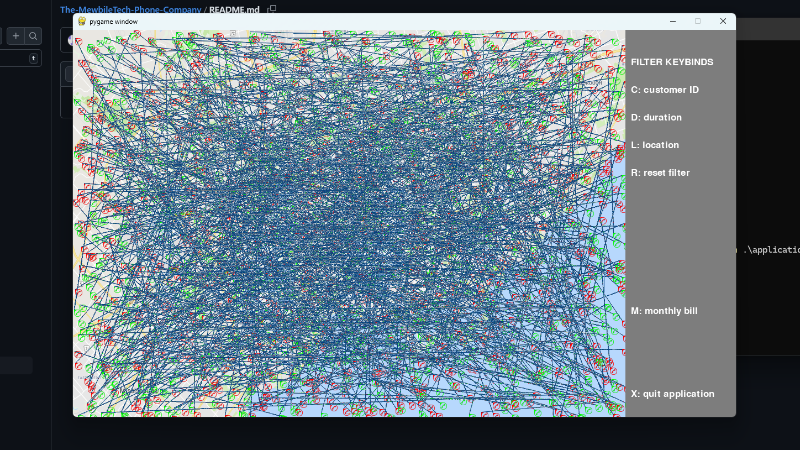

# **MewbileTech Phone Company 🌟**

## **Overview**

This project is a **phone company billing and visualization system**, developed as part of **CSC148 at the University of Toronto**. The goal was to **process customer call data**, apply various **filters**, and generate **monthly billing summaries**, all while visualizing call patterns on a map of **Toronto** using `pygame`.

## **Features**

✅ **Call Data Processing** – Reads a dataset of historical calls and organizes customer information.\
✅ **Billing System** – Calculates monthly bills based on contract types (**Term, Month-to-Month, Prepaid**).\
✅ **Call Filtering** – Supports filtering by **customer, location, duration**, and more.\
✅ **Visualization** – Uses `pygame` to display call connections on a real **Toronto map**.\
✅ **Parallel Processing (Optional Task)** – Experimented with threading to improve performance.

## **Screenshots**

*(These images show how the system works in action)*\

### **1️⃣ Initial View - All Calls Displayed**
This shows the visualization when all calls are displayed with no filters applied.


### **2️⃣ Filtering by Duration**
The user can apply a duration filter, for example, filtering calls with a duration greater than 25 seconds.


### **4️⃣ Monthly Bill Output**
The user selects a customer and a billing period, and the system generates the bill.


### **3️⃣ Filtering by Date**
The user inputs a specific month and year to filter calls and bills.


### **5️⃣ Filtered Output Example**
After applying multiple filters, the final displayed call data.


## **How to Run**

```sh
# Clone the repository
git clone https://github.com/Zain-Ghias/MewbileTech-Phone-Company.git
cd MewbileTech-Phone-Company

# Install dependencies
pip install -r requirements.txt

# Run the main application
python src/application.py
```

## **Running the Tests**

```sh
cd src
python sample_tests.py
```

## **Acknowledgment**

This project was developed as part of **CSC148 at the University of Toronto**. While the core structure was provided, all implementations, including data processing, billing, and filtering logic, were independently completed.

